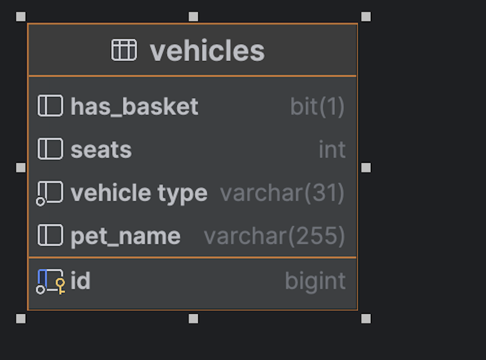
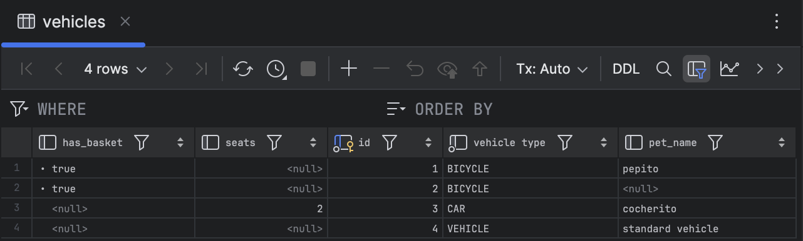
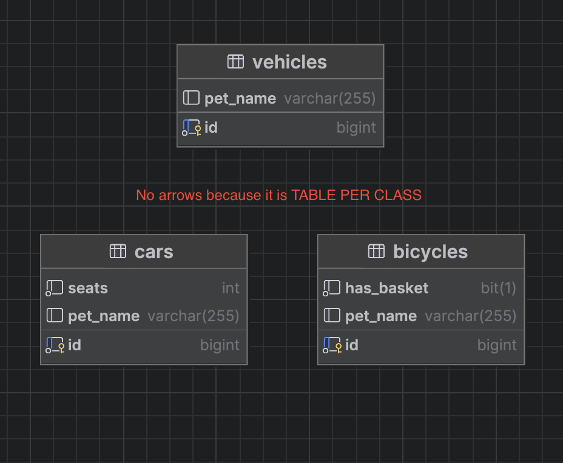
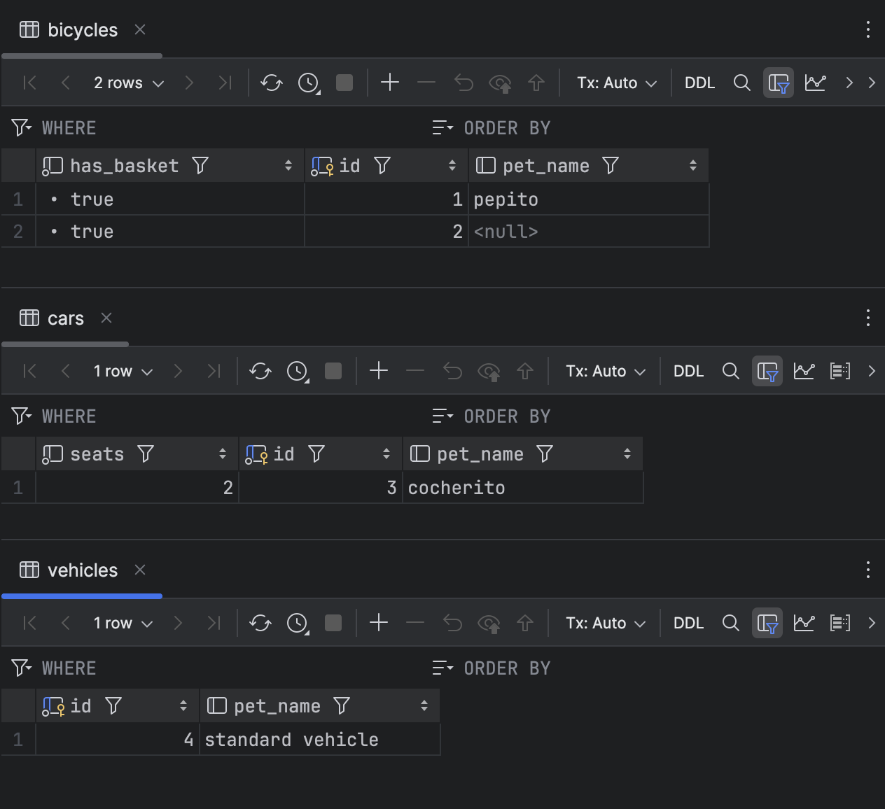
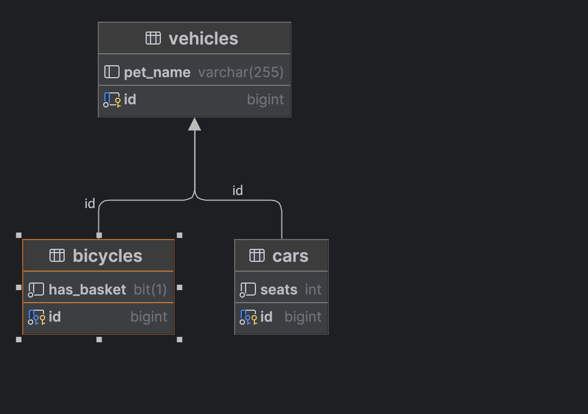
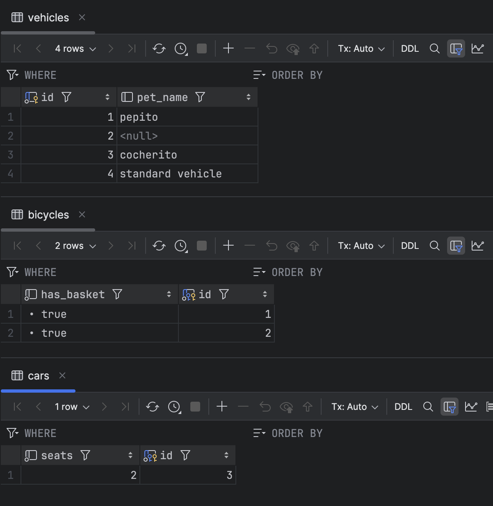
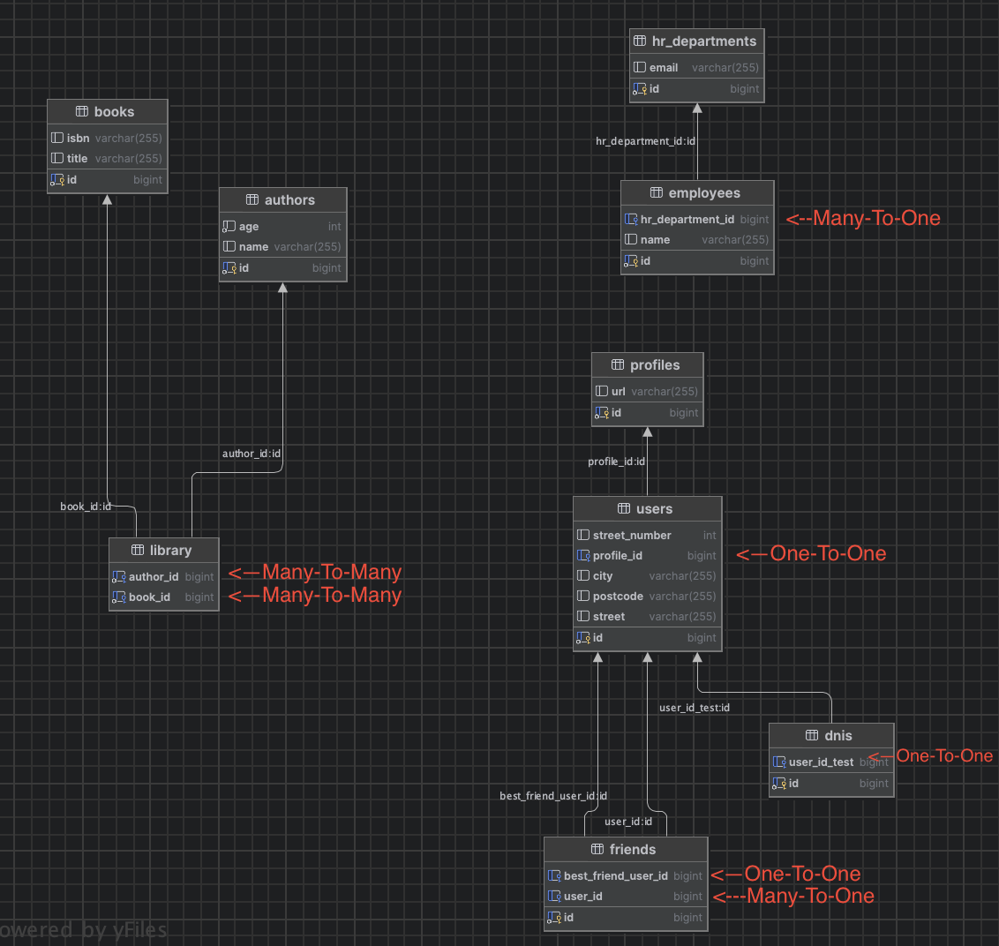

# Tuesday 07-05

## Herencia

- [Paquete de modelos](src/main/java/com/ironhack/tue0705/model/vehicles)
- [Paquete de repositorios](src/main/java/com/ironhack/tue0705/repository)
- [Test para crear datos: createDataTest()](src/test/java/com/ironhack/tue0705/model/VehicleTest.java)
- **[Embedded](src/main/java/com/ironhack/tue0705/model/users/Address.java)

### SINGLE_TABLE

---
### TABLE_PER_CLASS

---
### JOINED

---
## Relaciones

- [Paquete de modelos](src/main/java/com/ironhack/tue0705/model)
- [Test para crear datos: voidTest()](src/test/java/com/ironhack/tue0705/model/VehicleTest.java)
- **[Fetch](src/main/java/com/ironhack/tue0705/model/users/User.java)
- **[Fetch](src/main/java/com/ironhack/tue0705/model/users/Friend.java)

